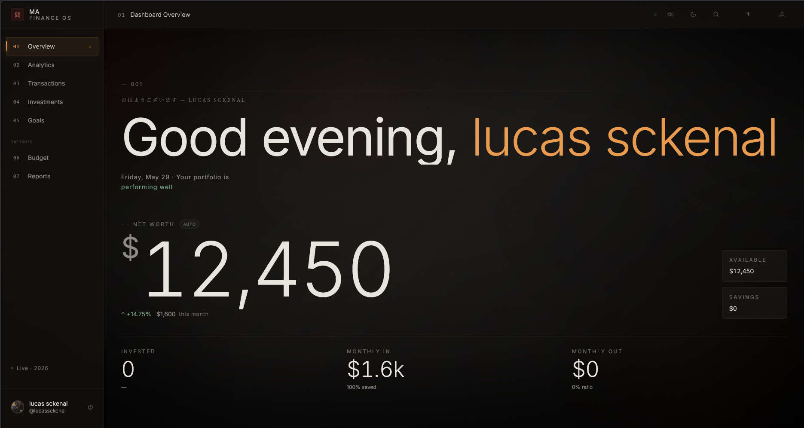
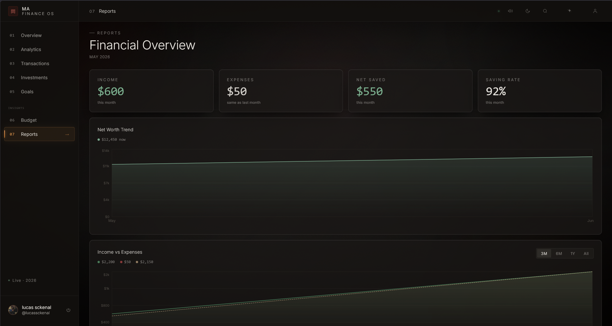
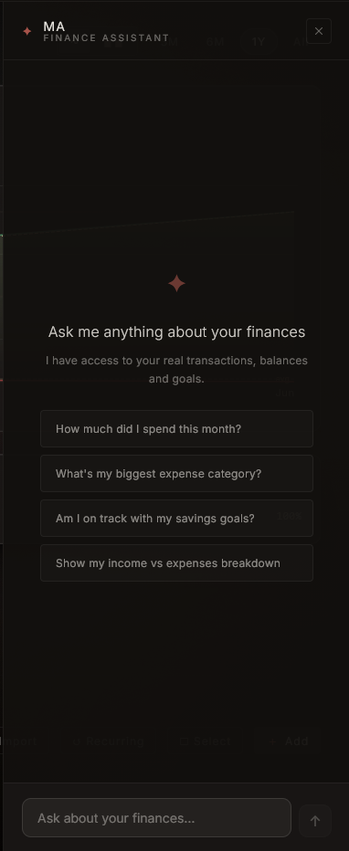
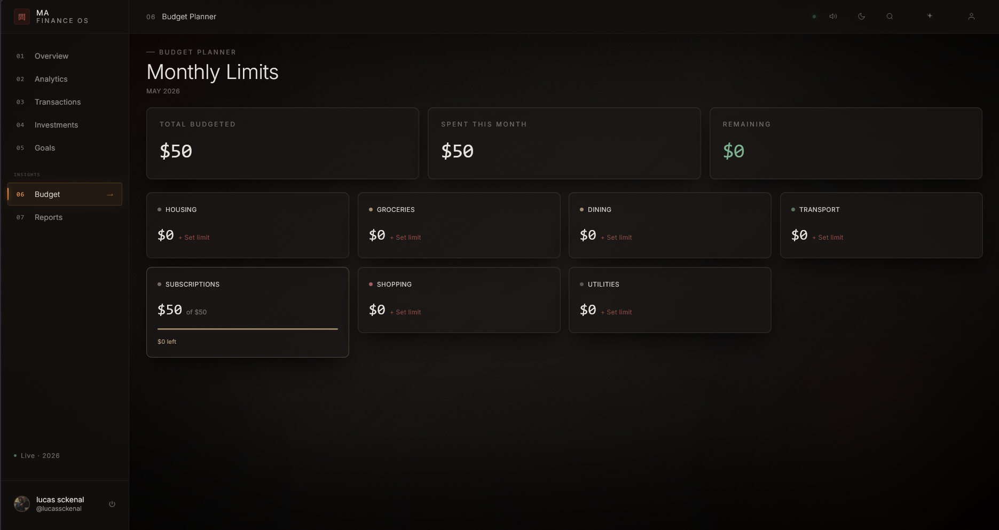

<div align="center">

# 間 · Ma Finance OS

### *Your financial reality, rendered.*

A cinematic, Japanese-minimalist personal finance operating system —
real-time data, AI that **acts**, and a design that respects your intelligence.

`English` · [`Português`](#-português)


</div>

---

## Demo

<div align="center">


</div>

> The inline GIF above is a ~10s autoplay teaser. The full 19s capture lives at
> `docs/screenshots/demo.mp4` (3 MB, full quality) — for a click-to-play video,
> drag that file into the GitHub README editor and paste the asset URL it
> generates in place of the GIF line.

---

## Screenshots

<div align="center">

| Dashboard | Reports |
|:---:|:---:|
|  |  |

| AI Assistant | Budget |
|:---:|:---:|
|  |  |

</div>

---

## What is it?

**Ma** (間 — the Japanese concept of negative space) is a personal finance app
built like a premium operating system. Dark ink-night palette, smooth-scroll
motion, and a serif-and-mono typographic system give it the feel of a product,
not a dashboard template.

Under the cinematic surface it's a complete finance tool: every number is real
and live from Firestore, and the built-in AI assistant doesn't just answer
questions — it can **create transactions, goals and budgets for you**, with a
confirmation step.

---

## Features

**🏦 Core**
- Net worth dashboard (computed automatically from cash + investments + goals)
- Transactions: full CRUD, search/filter, pagination, bulk edit & delete, CSV import/export
- Multi-account tracking (checking, savings, card, cash, investment) with transfers
- Budgets with live progress bars and over-limit alerts
- Goals with deposits, deadlines and progress
- Recurring transactions with automatic catch-up

**✦ AI assistant (Gemini)**
- Answers questions about your real data — *"How much did I spend on dining this month?"*
- **Takes actions** via function calling — *"Add a $50 groceries expense"* → proposes the action, you confirm, it's applied
- Streams in the language you write in

**📈 Insights & analytics**
- Proactive insight strip (spending trends, budget warnings, bills due, goal pacing)
- Reports: income vs expenses, savings-rate trend, net-worth history, category breakdown
- Live investment prices (Yahoo Finance) with gain/loss tracking

**✨ Experience**
- Bilingual UI (English / Português) with reactive switching
- Multi-currency with real FX conversion (frankfurter.app)
- PWA — installable, offline-capable
- Command palette (⌘K), keyboard shortcuts, light/dark themes, sound design
- Cinematic onboarding wizard for new users

---

## Tech stack

| Layer | Tech |
|---|---|
| Framework | Next.js 16 (App Router, Turbopack), React 19, TypeScript 5 |
| Styling | SCSS Modules · design tokens + mixins · Framer Motion · Lenis smooth scroll |
| Backend | Firebase — Auth, Firestore, Storage |
| Charts | Recharts |
| AI | Google Gemini (`@google/generative-ai`) with function calling |
| Auth (APIs) | Firebase ID-token verification via `jose` (JWKS, no service account) |

---

## Architecture

```
app/            Routes: / (landing), /dashboard, /auth, /budget, /reports,
                /profile, and /api/* (chat, quote, fx) — all token-protected
components/     Dashboard sections, UI primitives, drawers, onboarding
lib/            Firestore service, types, translations, categories, auth helpers
hooks/          Firestore subscriptions, currency, i18n (useT), motion
contexts/       Auth · Theme · Sound · Toast
styles/         SCSS tokens + mixins
```

**Security** — Firestore & Storage rules lock every user to their own data
(`firestore.rules`, `storage.rules`); API routes verify the caller's Firebase ID
token (`lib/verifyAuth.ts`) so quotas can't be abused anonymously.

---

## Getting started

```bash
npm install
cp .env.example .env.local   # fill in Firebase + Gemini keys
npm run dev                  # http://localhost:3000
```

---

## Deploy

1. Push to GitHub and import into [Vercel](https://vercel.com) (Next.js auto-detected).
2. Add the env vars from `.env.example` in **Project → Settings → Environment Variables**.
3. Deploy.
4. In **Firebase → Auth → Authorized domains**, add your Vercel domain.
5. Ship the security rules (free Spark plan):

```bash
firebase deploy --only firestore:rules,storage
```

Optional server-side recurring processing (Blaze plan) lives in `functions/` — see `functions/README.md`.

---
---

## 🇧🇷 Português

**Ma** (間 — o conceito japonês de espaço negativo) é um app de finanças pessoais
feito como um sistema operacional premium: paleta *ink-night*, movimento com
scroll suave e tipografia serifada + mono que dão cara de produto, não de
template de dashboard.

Por baixo do visual cinematográfico, é uma ferramenta completa: todos os números
são reais e ao vivo do Firestore, e o assistente de IA não só responde — ele
**cria transações, metas e orçamentos pra você**, sempre com confirmação.

**O que tem dentro**
- Patrimônio calculado automaticamente (caixa + investimentos + metas)
- Transações: CRUD completo, busca/filtro, edição e exclusão em massa, importar/exportar CSV
- Multi-conta (corrente, poupança, cartão, dinheiro) com transferências
- Orçamentos com barras de progresso e alertas; metas com depósitos e prazos
- Recorrências com recuperação automática de períodos perdidos
- **IA que age** (Gemini + function calling): *"Adiciona R$50 em mercado"* → propõe → você confirma
- Insights proativos, relatórios, preços de investimento ao vivo
- Bilíngue (EN/PT-BR), multi-moeda com conversão de câmbio real, PWA, command palette (⌘K), temas

**Como rodar**
```bash
npm install
cp .env.example .env.local   # preencha as chaves do Firebase + Gemini
npm run dev
```

**Deploy** — suba no GitHub, importe na Vercel, configure as variáveis de
ambiente do `.env.example`, adicione o domínio da Vercel no Firebase Auth e rode
`firebase deploy --only firestore:rules,storage`.

---

<div align="center">

*© 2026 · Built for clarity — a personal project / portfolio piece.*

</div>
